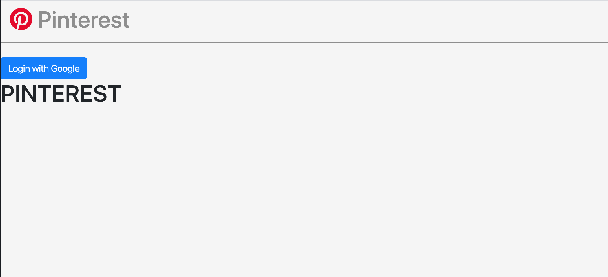
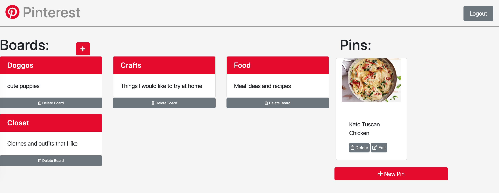
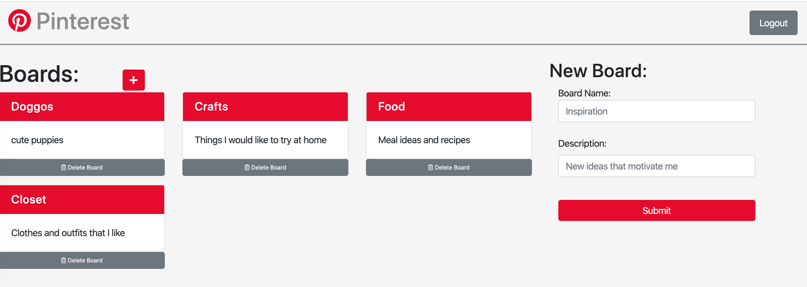
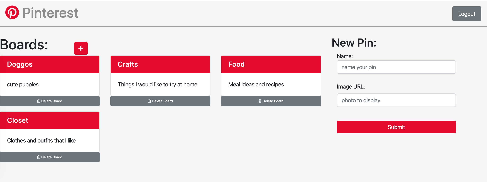
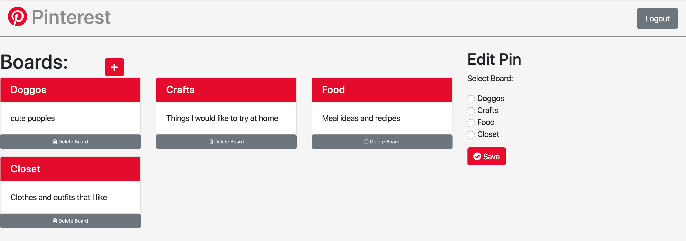

# NSS Exercise: "Pinterest”

### Technologies Used:
HTML5, SCSS/CSS, Vanilla Javascript, Webpack, Firebase

### Description:
NSS homework project, which introduces:
- Basic C.R.U.D. functions - Create, Read, Update, and Delete data
- Firebase for user authentication, database storage, and hosting

"Design single-page web app that re-creates the popular Pinterest app, using a system of boards and pins."

#### Exercise Requirements
- Clean code - single responsibility principle
- ES6 Modules bundled with webpack
- No errors - linters should be clean
- Jquery for any DOM manipulation (selectors, modifying css classes, events)
- SASS and Bootstrap for styling
- Completely planned out - project tickets, wireframes and ERD

### Screenshots:
#### Homepage - user logged out or not logged in

#### Homepage - user logged in, user boards display

#### Adding a new board or pin

#### Move pin to another board

### Instructions to Run:
[Click here to view the deployed web app](https://pinterest-19b.firebaseapp.com/)

Or, Run Locally:
1. If you do not have npm http-server installed, follow instuctions [here](https://www.npmjs.com/package/http-server) to install on your device
1. Use GitHub's [Cloning Feature](https://help.github.com/en/github/creating-cloning-and-archiving-repositories/cloning-a-repository) to download a local copy of the files for this project
1. In your command line interface, change directory into the folder that contains your copied files
1. Enter command: `npm install` and wait for completion
1. Enter command: `http-server -p 8080` or `hs -p 8080`
1. The project will now render in your browser at url: `http://localhost:8080`
